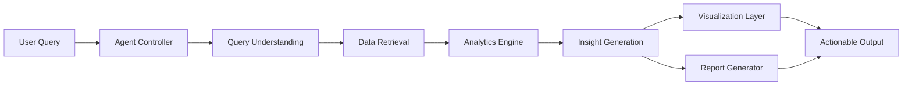

# Agentic AI Analytics Tools

<div align="center">


<p>
  
  
  
  
</p>

<p>
  
</p>

</div>

---

## Overview

Agentic AI Analytics Tools is a modern, modular, and intelligent analytics platform built for autonomous insight generation, tool calling, data interpretation, reporting, and decision support. It combines AI agents, analytics pipelines, visualization layers, and execution workflows into one system designed for real-world business intelligence.

---

## Scoreboard

<div align="center">

| Metric               |     Value | Status    |
| -------------------- | --------: | --------- |
| Agent Layers         |        4+ | Active    |
| Analytics Modules    |       10+ | Expanding |
| Visualization Types  |       12+ | Ready     |
| Automation Workflows |        8+ | Ready     |
| Decision Support     | Real Time | Online    |

</div>

---

## Feature Banner

<div align="center">

<table>
<tr>
<td align="center"><strong>Autonomous Agents</strong><br/>Plan, reason, act, and refine</td>
<td align="center"><strong>Smart Analytics</strong><br/>Transform raw data into insights</td>
<td align="center"><strong>Tool Calling</strong><br/>Connect APIs, databases, and models</td>
</tr>
<tr>
<td align="center"><strong>Visual Intelligence</strong><br/>Charts, dashboards, and KPI views</td>
<td align="center"><strong>Forecasting</strong><br/>Trend prediction and anomaly alerts</td>
<td align="center"><strong>Report Engine</strong><br/>Auto-generated summaries and reports</td>
</tr>
</table>

</div>

---

## Core Modules

### 1. Agent Controller

Central coordinator that manages task planning, reasoning flow, tool selection, and response generation.

### 2. Analytics Engine

Processes datasets, computes metrics, detects patterns, and produces structured insights.

### 3. Visualization Layer

Builds dashboards, KPI cards, charts, and summary views for fast interpretation.

### 4. Report Generator

Converts analysis into readable business reports, executive summaries, and action items.

### 5. Query Intelligence

Understands natural language prompts and routes them to the correct analytics workflow.

---

## Tech Stack

<div align="center">

| Layer            | Technologies                          |
| ---------------- | ------------------------------------- |
| Backend          | Python, FastAPI, Flask                |
| Agent Frameworks | LangChain, LangGraph, CrewAI          |
| AI Models        | OpenAI APIs, local LLMs, Hugging Face |
| Data Processing  | Pandas, NumPy, Polars                 |
| Visualization    | Plotly, Matplotlib, Seaborn, Dash     |
| Storage          | SQL, SQLite, PostgreSQL, Vector DB    |
| Frontend         | Streamlit, React, Tailwind CSS        |
| Deployment       | Docker, GitHub Actions, Cloud Run     |

</div>

---

## Animated System Flow



---

## Modern Interface Ideas

This project can include advanced UI blocks such as:

* Hero banner with animated gradient header
* KPI scoreboard with live metric cards
* Sidebar navigation for datasets, agents, and reports
* Insight timeline
* Trend radar panel
* Alert center for anomalies
* Smart command palette
* Theme toggle with glassmorphism panels
* Live data cards with subtle motion effects

---

## Command Center

```bash
# clone
 git clone https://github.com/yourusername/agentic-ai-analytics-tools.git
 cd agentic-ai-analytics-tools

# create environment
 python -m venv venv

# activate on Windows
 venv\Scripts\activate

# install dependencies
 pip install -r requirements.txt

# run the app
 python app.py
```

---

## Environment

Create a `.env` file:

```env
OPENAI_API_KEY=your_api_key
DATABASE_URL=your_database_url
SECRET_KEY=your_secret_key
```

---

## Project Structure

```bash
agentic-ai-analytics-tools/
├── agents/
├── analytics/
├── api/
├── dashboards/
├── data/
├── models/
├── reports/
├── utils/
├── visualization/
├── app.py
├── requirements.txt
└── README.md
```

---

## Feature Grid

<div align="center">

| Capability                 | Description                         |
| -------------------------- | ----------------------------------- |
| Natural Language Analytics | Ask questions in plain English      |
| Multi-Agent Planning       | Break tasks into smaller actions    |
| KPI Monitoring             | Track business metrics in real time |
| Predictive Forecasting     | Estimate upcoming trends            |
| Anomaly Detection          | Detect unusual spikes or drops      |
| Auto Reporting             | Generate executive summaries        |
| Visualization Automation   | Build charts without manual work    |
| Tool Integration           | Connect external APIs and databases |

</div>

---

## Example Prompts

```text
Analyze sales performance across the last 12 months.
Detect anomalies in traffic and conversions.
Forecast next quarter revenue based on current trends.
Generate an executive summary for the top product categories.
```

---

## Live Dashboard Sections

### Scoreboard

Displays revenue, conversions, retention, growth, and confidence score.

### Insight Stream

Shows auto-generated findings ranked by impact and urgency.

### Agent Activity

Tracks which agent handled which task and how the response was produced.

### Decision Panel

Highlights recommended actions, risks, and opportunities.

---

## Roadmap

* [ ] Multi-agent collaboration
* [ ] Voice command analytics
* [ ] Streaming dashboard updates
* [ ] AI-generated SQL queries
* [ ] Smart report export to PDF
* [ ] Memory-based personalization
* [ ] Forecast comparison engine
* [ ] Deployment-ready observability stack
* [ ] Interactive command palette
* [ ] Motion-based dashboard cards

---

## Contribution Flow

```text
Fork -> Branch -> Build -> Test -> Commit -> Pull Request
```

---

## License

MIT License

---

<div align="center">

<img src="[https://capsule-render.vercel.app/api?type=soft&height=120&section=footer&text=Built%20for%20the%20Future%20of%20AI%20Analytics&fontSize=24&f](https://capsule-render.vercel.app/api?type=soft&height=120&section=footer&text=Built%20for%20the%20Future%20of%20AI%20Analytics&fontSize=24&f)
